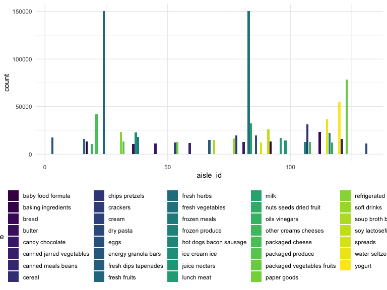

hw3\_dz2426
================
Duzhi Zhao
10/7/2019

## Problem 1

# Section 1.1

Comments:

There are 134 aisles in total and the aisle “fresh vegetables” has the
most items ordered from.

# Section 1.2

<!-- -->

# Section 1.3

    ## Selecting by n

Table 1: The three most popular products in each of the
aisles

| aisle                      | rank \#1                                      | rank \#2                            | rank \#3            |
| :------------------------- | :-------------------------------------------- | :---------------------------------- | :------------------ |
| baking ingredients         | Light Brown Sugar                             | Pure Baking Soda                    | Cane Sugar          |
| dog food care              | Snack Sticks Chicken & Rice Recipe Dog Treats | Organix Chicken & Brown Rice Recipe | Small Dog Biscuits  |
| packaged vegetables fruits | Organic Baby Spinach                          | Organic Raspberries                 | Organic Blueberries |

| aisle                      | product\_name                                 | ordered\_times | rank |
| :------------------------- | :-------------------------------------------- | -------------: | ---: |
| baking ingredients         | Light Brown Sugar                             |            499 |    1 |
| baking ingredients         | Pure Baking Soda                              |            387 |    2 |
| baking ingredients         | Cane Sugar                                    |            336 |    3 |
| dog food care              | Snack Sticks Chicken & Rice Recipe Dog Treats |             30 |    1 |
| dog food care              | Organix Chicken & Brown Rice Recipe           |             28 |    2 |
| dog food care              | Small Dog Biscuits                            |             26 |    3 |
| packaged vegetables fruits | Organic Baby Spinach                          |           9784 |    1 |
| packaged vegetables fruits | Organic Raspberries                           |           5546 |    2 |
| packaged vegetables fruits | Organic Blueberries                           |           4966 |    3 |

Table 2: mean hour of the day at which Pink Lady Apples and Coffee Ice
Cream are ordered on each day of the
week

| order\_day | pink\_lady\_apples\_order\_hr | coffee\_ice\_cream\_order\_hr |
| :--------- | ----------------------------: | ----------------------------: |
| Mon        |                            13 |                            14 |
| Tue        |                            11 |                            14 |
| Wed        |                            12 |                            15 |
| Thu        |                            14 |                            15 |
| Fri        |                            12 |                            15 |
| Sat        |                            13 |                            12 |
| Sun        |                            12 |                            14 |
