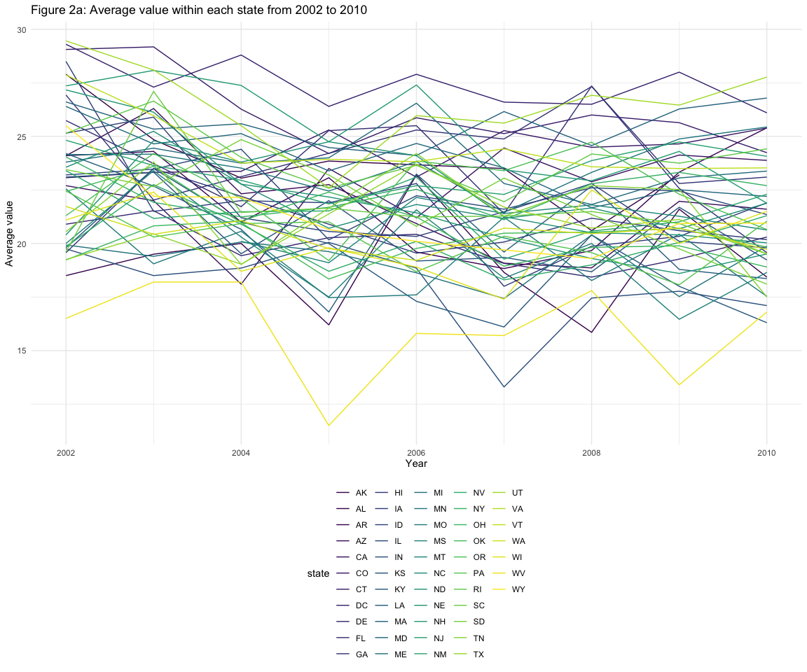

hw3\_dz2426
================
Duzhi Zhao
10/7/2019

## Problem 1

# Description of “Instacart” dataset

Comments:

This limited “Instacart” dataset contains 1,384,617 observations of
131,209 unique users, and 15 columns of variables. Some key variables
are “aisle” “department”, “product\_name”, “reordered”, and
“order\_dow”.

“aisle” contains 134 groups, such as yogurt, fresh vegetables, and fresh
fruits. “product\_name” includes 39123 products, such as Bulgarian
Yogurt, Organic Celery Hearts, and Bag of Organic Bananas. “department”
includes 21 departments, such as dairy eggs, produce, canned goods.
“reordered” shows whether the item has been ordered by this user in
the past. “order\_dow” indicates the day of the week on which the order
is placed

# Section 1.1

Comments:

There are 134 aisles in total and the aisle “fresh vegetables” has the
most items ordered
from.

# Section 1.2

# Section 1.3

Table 1: The three most popular products in each of the
aisles

| aisle                      | product\_name                                 | ordered\_times |
| :------------------------- | :-------------------------------------------- | -------------: |
| baking ingredients         | Light Brown Sugar                             |            499 |
| baking ingredients         | Pure Baking Soda                              |            387 |
| baking ingredients         | Cane Sugar                                    |            336 |
| dog food care              | Snack Sticks Chicken & Rice Recipe Dog Treats |             30 |
| dog food care              | Organix Chicken & Brown Rice Recipe           |             28 |
| dog food care              | Small Dog Biscuits                            |             26 |
| packaged vegetables fruits | Organic Baby Spinach                          |           9784 |
| packaged vegetables fruits | Organic Raspberries                           |           5546 |
| packaged vegetables fruits | Organic Blueberries                           |           4966 |

# Section 1.4

Table 2: mean hour of the day at which Pink Lady Apples and Coffee Ice
Cream are ordered on each day of the
week

| order\_day | pink\_lady\_apples\_order\_hr | coffee\_ice\_cream\_order\_hr |
| :--------- | ----------------------------: | ----------------------------: |
| Mon        |                            13 |                            14 |
| Tue        |                            11 |                            14 |
| Wed        |                            12 |                            15 |
| Thu        |                            14 |                            15 |
| Fri        |                            12 |                            15 |
| Sat        |                            13 |                            12 |
| Sun        |                            12 |                            14 |

## Problem 2

# Section 2.1

Comments:

In 2002, CT, FL, MA, NC, NJ, PA were observed at 7 or more locations. In
2010, CA, CO, FL, MA, MD, NC, NE, NJ, NY, OH, PA, SC, TX, WA were
observed at 7 or more
locations.

# Section 2.2

# Section 2.3

## Problem 3

# Section 3.1

Comments:

The tidied “accel\_data” dataset contains 35 observations and 1444
variables. Variable “week” includes number 1-5, indicating the number of
weeks this experiment was at. Variable “day” refers to the day the
accelerometer was monitoring on. Variable “if\_weekday” determines if
the day is a weekday or weeekend. The rest of the “activity” columns
represent the activity counts for each minute of a 24-hour day starting
at midnight. A total of 1440 minutes of activity data was included.

# Section 3.2

Comments:

Table 3: Total activity in minutes for each day over 5
weeks

| week | Monday | Tuesday | Wednesday | Thursday | Friday | Saturday | Sunday |
| ---: | -----: | ------: | --------: | -------: | -----: | -------: | -----: |
|    1 |  78828 |  307094 |    340115 |   355924 | 480543 |   376254 | 631105 |
|    2 | 295431 |  423245 |    440962 |   474048 | 568839 |   607175 | 422018 |
|    3 | 685910 |  381507 |    468869 |   371230 | 467420 |   382928 | 467052 |
|    4 | 409450 |  319568 |    434460 |   340291 | 154049 |     1440 | 260617 |
|    5 | 389080 |  367824 |    445366 |   549658 | 620860 |     1440 | 138421 |

# Section 3.3
