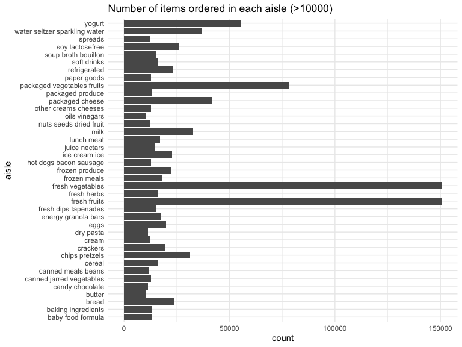

hw3\_dz2426
================
Duzhi Zhao
10/7/2019

## Problem 1

# Section 1.1

``` r
# Import data set "instacart"
library(p8105.datasets)
data("instacart")

instacart_data_q1 = instacart %>% 
  janitor::clean_names() %>%
  count(aisle) %>% #count the number of items in each group of aisle
  arrange(desc(n))  #sort in descending order
```

Comments:

There are 134 aisles in total and the aisle “fresh vegetables” has the
most items ordered from.

# Section 1.2

``` r
items_order_df = instacart %>% 
  janitor::clean_names() %>% 
  count(aisle_id, aisle) %>% #count the number of items in each group of aisle
  filter(n > 10000) %>% #filter items ordered > 10000
  arrange(desc(n)) %>% #sort items ordered in descending order 
  rename(count = n)
  
ggplot(items_order_df) +
  geom_col(aes(x = aisle_id, y = count, fill = aisle), position = "dodge") 
```


